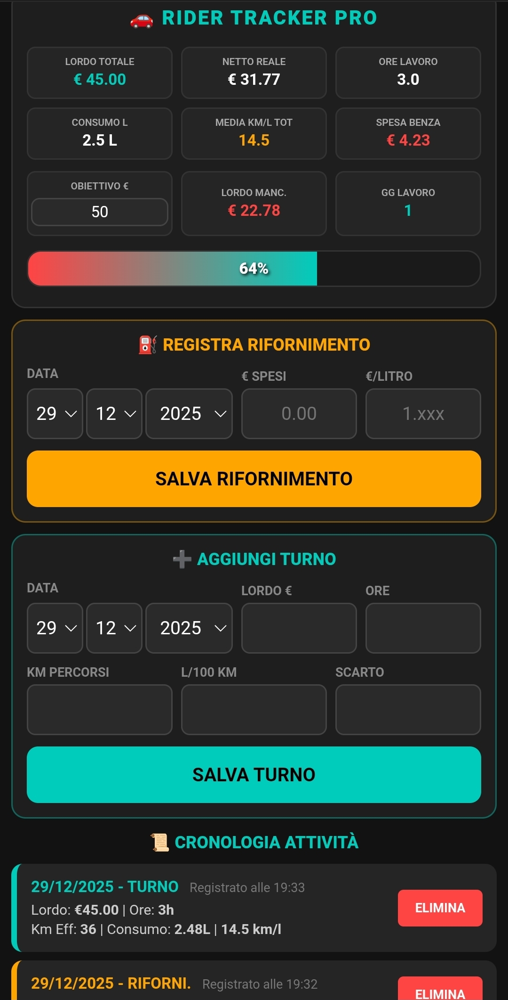

<h1 align="center">🚗 Rider Tracker Pro (v1.0.942)</h1>

<b>🌍 Want this app in your language? Leave a comment in the <a href="../../discussions">Discussions</a>!</b>

<b>Gestione professionale dei guadagni reali e dei consumi per Rider.</b> 

<i>Ottimizzato per corrieri e rider delle principali piattaforme di delivery.</i>

<code>Deliveroo</code> • <code>Glovo</code> • <code>Uber Eats</code> • <code>Just Eat</code> • <code>Foodracers</code> • <code>InPost</code> • <code>Amazon Flex</code>

## 🇮🇹 Descrizione (Italiano)

**Rider Tracker Pro** è una Progressive Web App (PWA) avanzata, sviluppata per i rider delle consegne che necessitano di una visione chiara sui loro guadagni effettivi.

A differenza di altri strumenti, questa app non si ferma al lordo: calcola il **Netto Reale** sottraendo la ritenuta d'acconto (20%) e le spese di carburante basate sul consumo reale del mezzo. È lo strumento ideale per chi lavora con le principali piattaforme di logistica e delivery.

### ✨ Novità della Versione 1.0.942:

- 📊 **Media KM/L Totale:** La media chilometrica di tutte le sessioni sempre visibile nel riepilogo.

- 🕒 **Cronologia con Orari:** Ogni turno e ogni rifornimento mostra la data e l'**ora esatta** di registrazione.

- ⛽ **Dettagli Rifornimento:** Calcolo automatico dei litri immessi nel serbatoio basato su spesa e prezzo al litro.

- 🎯 **Target Progressivo:** Monitora il tuo obiettivo netto mensile con barra dinamica.

- 🔒 **Privacy:** Dati salvati localmente (LocalStorage). Nessun server esterno.

## 🇬🇧 Description (English)

**Rider Tracker Pro** is a high-performance PWA for delivery riders. It provides a crystal-clear view of **Real Net Profit** by automatically deducting tax withholding (20%) and fuel costs. Perfect for multi-apping on all major platforms.

### ✨ Key Features (v1.0.942):

- 📊 **Total KM/L Average:** Real-time calculation of your monthly fuel efficiency.

- 🕒 **Timestamps:** Every entry logged with the **exact date and time**.

- ⛽ **Fuel Details:** Automatically tracks liters added and per-shift efficiency.

- 🎯 **Goal Tracking:** Visual progress bar toward your monthly net target.

## 🛠️ Tech Stack

- **Version:** 1.0.942

- **Languages:** HTML5, CSS3, JavaScript (Vanilla JS)

- **Persistence:** LocalStorage API (Offline-first)

## 📦 Installazione / Installation

1. Scarica il file `index.html`.

2. Aprilo nel browser del tuo smartphone (Chrome o Safari).

3. Usa la funzione **"Aggiungi a schermata Home"** per installarla come un'app nativa.

## 💬 Community & Feedback

🇮🇹 <b>Aiutami a migliorare l'app!</b> 

👉 Partecipa alle <b><a href="../../discussions">Discussions</a></b> per pareri e idee sulla v1.0.943! 

👉 Apri una <b><a href="../../issues">Issue</a></b> per segnalare bug tecnici.

 

🇬🇧 <b>Let's build together!</b> 

👉 Join the <b><a href="../../discussions">Discussions</a></b> tab to share your feedback! 

👉 Use the <b><a href="../../issues">Issues</a></b> tab for technical bugs.

<i>"La migliore versione del codice è la versione 1.0.942."</i>

